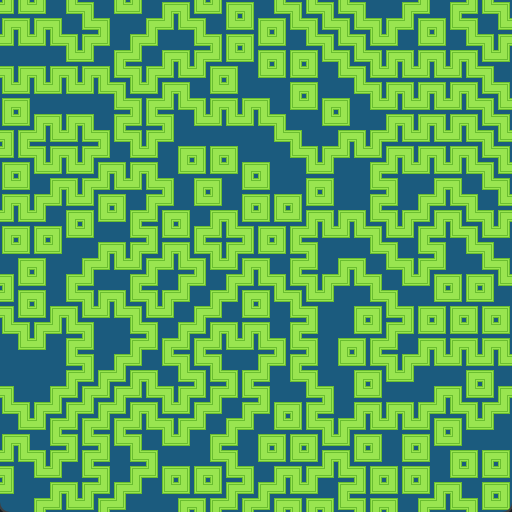

# wfc

波函数坍缩（Wave Function Collapse）算法的个人实践。

一个 32x32 生成图像例子：



核心定义如下：

```cxx
// 设置每种图块的权重
wfc.getWeights() = {
    1, 1, 1, 1, 1
};
// 设置影响范围（四向相邻）和影响算法
wfc.getDiffuseFuncs().emplace_back(
    std::vector(cha::DIR4, cha::DIR4 + 4),
    [](auto bitset, auto dir) {
        cha::WaveFunctionCollapse::BitsetType res;
        if (dir.y) {
            res = (bitset & 1u) << 2
                | (bitset & 2u) << 1
                | (bitset & 4u) >> 2
                | (bitset & 8u) >> 3;
            res *= 3;
        } else {
            res = (bitset & 1u) << 1
                | (bitset & 2u) >> 1
                | (bitset & 4u) >> 1
                | (bitset & 8u) >> 3;
            res *= 5;
        }
        if (dir.y < 0) res |= !!(bitset & 0b0011u) << 4; else {
        if (dir.y > 0) res |= !!(bitset & 0b1100u) << 4; else {
        if (dir.x < 0) res |= !!(bitset & 0b0101u) << 4; else {
        if (dir.x > 0) res |= !!(bitset & 0b1010u) << 4; }}}
        if (bitset & 16u) {
            if (dir.y < 0) res |= 0b1100u; else {
            if (dir.y > 0) res |= 0b0011u; else {
            if (dir.x < 0) res |= 0b1010u; else {
            if (dir.x > 0) res |= 0b0101u; }}}
            res |= 16u;
        }
        return res;
    }
);
```

本程序能够可视化 WFC 算法的生成步骤（通过常量 `ASYNC_ON` 开关）。

---
